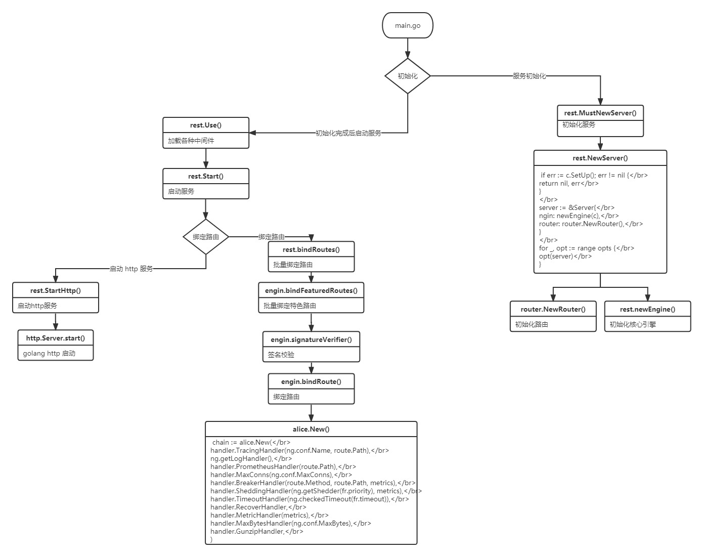

[TOC]
# go-zero 源码阅读

go-zero 作为一个微服务框架，不仅给我们提供了很好的参考，而且核心代码量不多，我们可以在闲暇时间读读他的核心代码，来多多学习充电。

go-zero 源码为 v1.3.1 版本，如更新有改动，请参考新版本

### rest 部分

#### 代码结构

```
rest
├── handler // 自带中间件
│   ├── authhandler.go // 权限
│   ├── breakerhandler.go // 断路器
│   ├── contentsecurityhandler.go // 安全验证
│   ├── cryptionhandler.go // 加密解密
│   ├── gunziphandler.go // zip 压缩
│   ├── loghandler.go // 日志
│   ├── maxbyteshandler.go // 最大请求数据限制
│   ├── maxconnshandler.go // 最大请求连接数限制
│   ├── metrichandler.go // 请求指标统计
│   ├── prometheushandler.go // prometheus 上报
│   ├── recoverhandler.go // 错误捕获
│   ├── sheddinghandler.go // 过载保护
│   ├── timeouthandler.go // 超时控制
│   └── tracinghandler.go // 链路追踪
├── httpx
│   ├── requests.go
│   ├── responses.go
│   ├── router.go
│   ├── util.go
│   └── vars.go
├── internal
│   ├── cors // 跨域处理
│   │   └── handlers.go
│   ├── response
│   │   ├── headeronceresponsewriter.go
│   │   └── withcoderesponsewriter.go
│   ├── security // 加密处理
│   │   └── contentsecurity.go
│   ├── log.go
│   └── starter.go
├── pathvar // path 参数解析
│   └── params.go
├── router
│   └── patrouter.go
├── token
│   └── tokenparser.go
├── config.go // 配置
├── engine.go // 引擎
├── server.go
└── types.go
```

#### 服务启动流程

我们以 go-zero-example 项目 http/demo/main.go 代码来分析



go-zero 给我们提供了如下组件与服务，我们来逐一阅读分析

- http框架常规组件（路由、调度器、中间件、跨域）
- 权限控制
- 断路器
- 限流器
- 过载保护
- prometheus
- trace
- cache

#### http框架常规组件

##### 路由

路由使用的是二叉查找树，高效的路由都会使用树形结构来构建

二叉查找树可参见源码

https://github.com/zeromicro/go-zero/tree/master/core/search

go-zero 路由实现了 http\server.go Handler interface 来拦截每个请求

入口源码地址: github.com/zeromicro/go-zero/rest/router/patrouter.go

```go
func (pr *patRouter) ServeHTTP(w http.ResponseWriter, r *http.Request) {
	reqPath := path.Clean(r.URL.Path) // 返回相当于path的最短路径名称
	if tree, ok := pr.trees[r.Method]; ok { // 查找对应 http method
		if result, ok := tree.Search(reqPath); ok { // 查找路由 path 
			if len(result.Params) > 0 {
				r = pathvar.WithVars(r, result.Params) // 获取路由参数并且添加到 *http.Request 中
			}
			result.Item.(http.Handler).ServeHTTP(w, r) // 调度方法
			return
		}
	}

	allows, ok := pr.methodsAllowed(r.Method, reqPath)
	if !ok {
		pr.handleNotFound(w, r)
		return
	}

	if pr.notAllowed != nil {
		pr.notAllowed.ServeHTTP(w, r)
	} else {
		w.Header().Set(allowHeader, allows)
		w.WriteHeader(http.StatusMethodNotAllowed)
	}
}
```

##### 调度器

go-zero 没有调度器，在上文 ServeHTTP 中已经使用了调度器，这归结于 golang 已经给我们实现了一个很好的 http 模块，如果是其他语言，我们在设计框架的时候往往要自己实现调度器。

##### 中间件

我们可以在 *.api 中添加如下代码来使用

```go
@server(
	middleware: Example // 路由中间件声明
)
service User {
	@handler UserInfo
	post /api/user/userinfo returns (UserInfoResponse)
}
```

 通过生成代码命令，生成的代码如下

```go
package middleware

import (
	"log"
	"net/http"
)

type ExampleMiddleware struct{}

func NewExampleMiddleware() *ExampleMiddleware {
	return &ExampleMiddleware{}
}

func (m *ExampleMiddleware) Handle(next http.HandlerFunc) http.HandlerFunc {
	return func(w http.ResponseWriter, r *http.Request) {
		// TODO generate middleware implement function, delete after code implementation
		next(w, r)
	}
}
```

go-zero 给我们提供了一些常用的中间件，方便我们在开发时候使用

- rest.WithCors() 跨域设置

```go
// example
server := rest.MustNewServer(c.RestConf, rest.WithCors("localhost:8080"))

// 源码
func WithCors(origin ...string) RunOption {
	return func(server *Server) {
		server.router.SetNotAllowedHandler(cors.NotAllowedHandler(nil, origin...))
		server.Use(cors.Middleware(nil, origin...))
	}
}
```

##### 跨域

- resrt.WithCustomCors() 自定义跨域方法

```go
// example
var origins = []string{
	"localhost:8080",
}
server := rest.MustNewServer(c.RestConf,
	rest.WithCustomCors(
        // 设置 http header
		func(header http.Header) {
			header.Set("Access-Control-Allow-Origin", "Access-Control-Allow-Origin")
		},
        // 不允许地址返回指定数据
		func(writer http.ResponseWriter) {
			writer.Write([]byte("not allow"))
		},
        // 允许跨域地址
		origins...,
	),
)

// 源码
func WithCustomCors(middlewareFn func(header http.Header), notAllowedFn func(http.ResponseWriter),
	origin ...string) RunOption {
	return func(server *Server) {
		server.router.SetNotAllowedHandler(cors.NotAllowedHandler(notAllowedFn, origin...))
		server.Use(cors.Middleware(middlewareFn, origin...))
	}
}
```

- rest.WithJwt()  jwt

```go
// example
rest.WithJwt("uOvKLmVfztaXGpNYd4Z0I1SiT7MweJhl")

// 源码
func WithJwt(secret string) RouteOption {
	return func(r *featuredRoutes) {
		validateSecret(secret)
		r.jwt.enabled = true
		r.jwt.secret = secret
	}
}
```

- rest.WithJwtTransition() jwt token 转换，新老 token 可以同时使用

```go
// example
rest.WithJwtTransition("uOvKLmVfztaXGpNYd4Z0I1SiT7MweJhl", "uOvKLmVfztaXGpNYd4Z0I1SiT7MweJh2")

// 源码
func WithJwtTransition(secret, prevSecret string) RouteOption {
	return func(r *featuredRoutes) {
		// why not validate prevSecret, because prevSecret is an already used one,
		// even it not meet our requirement, we still need to allow the transition.
		validateSecret(secret)
		r.jwt.enabled = true
		r.jwt.secret = secret
		r.jwt.prevSecret = prevSecret
	}
}
```

#### 权限控制

入口源码地址：github.com/zeromicro/go-zero/rest/handler/authhandler.go

权限控制核心文件带注释代码如下，大家可以参阅

- https://github.com/TTSimple/go-zero-source/tree/master/code/rest/rest/handler/authhandler.go
- https://github.com/TTSimple/go-zero-source/tree/master/code/rest/rest/token/tokenparser.go

go-zero 提供 jwt 权限控制，jwt 只做登录与未登录验证，细粒度的权限验证我们可以使用其他成熟方案

jwt 原理不复杂，有兴趣的可以翻阅[源码](github.com/golang-jwt/jwt)学习


#### 熔断器

入口源码地址：github.com/zeromicro/go-zero/rest/handler/breakerhandler.go

go-zero 的熔断器基于滑动窗口来实现，我们首先来看看滑动窗口是啥

leetcode 中有这样一个题目：[剑指 Offer II 041. 滑动窗口的平均值](https://leetcode-cn.com/problems/qIsx9U/)

```go
给定一个整数数据流和一个窗口大小，根据该滑动窗口的大小，计算滑动窗口里所有数字的平均值。

实现 MovingAverage 类：

MovingAverage(int size) 用窗口大小 size 初始化对象。
double next(int val) 成员函数 next 每次调用的时候都会往滑动窗口增加一个整数，请计算并返回数据流中最后 size 个值的移动平均值，即滑动窗口里所有数字的平均值。

示例：

输入：
inputs = ["MovingAverage", "next", "next", "next", "next"]
inputs = [[3], [1], [10], [3], [5]]
输出：
[null, 1.0, 5.5, 4.66667, 6.0]

解释：
MovingAverage movingAverage = new MovingAverage(3);
movingAverage.next(1); // 返回 1.0 = 1 / 1
movingAverage.next(10); // 返回 5.5 = (1 + 10) / 2
movingAverage.next(3); // 返回 4.66667 = (1 + 10 + 3) / 3
movingAverage.next(5); // 返回 6.0 = (10 + 3 + 5) / 3
```

我们来想一想解题思路：

- 窗口大小是固定的
- 窗口每次都会滑动
- 窗口滑动是替换就数据

我们来解一解题：

```go
type MovingAverage struct {
	index   int   // 当前环形数组的位置
	count   int   // 数组大小
	sum     int   // 数据总量
	buckets []int // 环形数组
}

/** Initialize your data structure here. */
func Constructor(size int) MovingAverage {
	return MovingAverage{index: size - 1, buckets: make([]int, size)}
}

func (ma *MovingAverage) Next(val int) float64 {
	ma.sum += val
	ma.index = (ma.index + 1) % len(ma.buckets) // 循环数组索引
	if ma.count < len(ma.buckets) {
		ma.count++
		ma.buckets[ma.index] = val
	} else {
		ma.sum -= ma.buckets[ma.index] // 减去旧数据
		ma.buckets[ma.index] = val     // 替换旧数据
	}
	return float64(ma.sum) / float64(ma.count)
}

func Test_Demo(t *testing.T) {
	ma := Constructor(3)
	fmt.Println(ma.Next(1))  // 返回 1.0 = 1 / 1
	fmt.Println(ma.Next(10)) // 返回 5.5 = (1 + 10) / 2
	fmt.Println(ma.Next(3))  // 返回 4.66667 = (1 + 10 + 3) / 3
	fmt.Println(ma.Next(5))  // 返回 6.0 = (10 + 3 + 5) / 3
}
```

从解题的代码中我们可以看到滑动窗口的本质是循环数组，而循环数组的核心思路是

1. 循环数组的索引

```go
ma.index = (ma.index + 1) % len(ma.cache) // 循环数组索引
```

2. 新数据替换旧数据

```go
ma.sum -= ma.cache[ma.index] // 减去旧数据
ma.cache[ma.index] = val     // 替换旧数据
```

再来看看 go-zero 的 rollingwidnow，是不是和前面学习的滑动窗口是一样一样的呀 : )

```go
type window struct {
	buckets []*Bucket // 环形数组
	size    int
}

// 初始化窗口
func newWindow(size int) *window {
	buckets := make([]*Bucket, size)
	for i := 0; i < size; i++ {
		buckets[i] = new(Bucket)
	}
	return &window{
		buckets: buckets,
		size:    size,
	}
}

// 往执行的 bucket 加入指定的指标数据
func (w *window) add(offset int, v float64) {
    // 窗口滑动代码
    // rw.offset = (offset + span) % rw.size
	w.buckets[offset%w.size].add(v)
}
```

滑动窗口看完了，我们再来看看柳暗花明又一村的[Google Sre过载保护算法](https://sre.google/sre-book/handling-overload/#eq2101)

其算法数学表达式如下：


- requests：请求数量（调用方发起请求的数量总和）
- accepts：请求接受数量（被调用方正常处理的请求数量）
- K：倍值（越小越敏感）

[go-zero 算法代码实现](https://github.com/zeromicro/go-zero/blob/e9620c8c053fcf3732344741e04b28b8512bcf36/core/breaker/googlebreaker.go#L41)

```go
// 判断是否触发熔断
func (b *googleBreaker) accept() error {
	accepts, total := b.History()
	weightedAccepts := b.k * float64(accepts)
	// Google Sre过载保护算法 https://landing.google.com/sre/sre-book/chapters/handling-overload/#eq2101
	dropRatio := math.Max(0, (float64(total-protection)-weightedAccepts)/float64(total+1))
	if dropRatio <= 0 {
		return nil
	}

	if b.proba.TrueOnProba(dropRatio) {
		return ErrServiceUnavailable
	}

	return nil
}
```

go-zero 熔断器给我们提供如下方法，更我们使用：

```go
type (
	// 自定义判定执行结果
	Acceptable func(err error) bool
	// 手动回调
	Promise interface {
		// Accept tells the Breaker that the call is successful.
		// 请求成功
		Accept()
		// Reject tells the Breaker that the call is failed.
		// 请求失败
		Reject(reason string)
	}
	Breaker interface {
		// 熔断器名称
		Name() string

		// 熔断方法，执行请求时必须手动上报执行结果
		// 适用于简单无需自定义快速失败，无需自定义判定请求结果的场景
		// 相当于手动挡。。。
		Allow() (Promise, error)

		// 熔断方法，自动上报执行结果
		// 自动挡。。。
		Do(req func() error) error

		// 熔断方法
		// acceptable - 支持自定义判定执行结果
		DoWithAcceptable(req func() error, acceptable Acceptable) error

		// 熔断方法
		// fallback - 支持自定义快速失败
		DoWithFallback(req func() error, fallback func(err error) error) error

		// 熔断方法
		// fallback - 支持自定义快速失败
		// acceptable - 支持自定义判定执行结果
		DoWithFallbackAcceptable(req func() error, fallback func(err error) error, acceptable Acceptable) error
	}
)
```

关于 go-zero 熔断器的文章就到这里啦，看完之后是不是觉得很简单，觉得不简单可以多读几遍，感谢大家的阅读。

[熔断器保姆级带注释源码，点击可得](https://github.com/TTSimple/go-zero-source/tree/master/code/breaker)

引用文章：

- [一文讲透自适应熔断的原理和实现](https://juejin.cn/post/7030997067560386590)
- [go-zero服务治理-自适应熔断器](https://juejin.cn/post/7028536954262126605)
- [golang-熔断器](https://www.jianshu.com/p/218d8f3d9763)
- [服务自适应熔断原理与实现](https://juejin.cn/post/6891836358155829262)

#### 过载保护

入口源码地址：github.com/zeromicro/go-zero/rest/handler/sheddinghandler.go

在看文章之前可以看看万总的这篇文章[《服务自适应降载保护设计》](https://go-zero.dev/cn/loadshedding.html)，文章已经给我们介绍很清楚了，从基础原理到架构需求再到代码注释，无不细致入微，感谢万总。

之前在设计架构的时候对于服务过载保护只会想到在客户端、网关层来实现，没考虑过在服务端也可以达到这种效果，一来涉及这种技术的文章较少(可能是我孤陋寡闻了)，二来服务端不确定的情况比较多，比如服务器出现问题，或者其他在同一台服务器运行的软件把服务器直接搞挂，这样在服务端实现过载保护在某些层面来说鲁棒性可能不太好 ，但在和熔断器结合后，用服务端来实现过载保护也是合情合理的。

我们来看下过载保护设计到的几个算法

##### 自旋锁

- 原理

问：假设有1个变量`lock`，2个协程怎么用锁实现`lock++`，`lock`的结果最后为2

答：

1. 锁也是1个变量，初值设为0；

2. 1个协程将锁原子性的置为1；

3. 操作变量`lock`；

4. 操作完成后，将锁原子性的置为0，释放锁。

5. 在1个协程获取锁时，另一个协程一直尝试，直到能够获取锁（不断循环），这就是自旋锁。

2、自旋锁的缺点

某个协程持有锁时间长，等待的协程一直在循环等待，消耗CPU资源。

不公平，有可能存在有的协程等待时间过程，出现线程饥饿（这里就是协程饥饿）

- go-zero  自旋锁源码

```go
type SpinLock struct {
    // 锁变量
	lock uint32
}

// Lock locks the SpinLock.
func (sl *SpinLock) Lock() {
	for !sl.TryLock() {
        // 暂停当前goroutine，让其他goroutine先行运算
		runtime.Gosched()
	}
}

// TryLock tries to lock the SpinLock.
func (sl *SpinLock) TryLock() bool {
    // 原子交换，0换成1
	return atomic.CompareAndSwapUint32(&sl.lock, 0, 1)
}

// Unlock unlocks the SpinLock.
func (sl *SpinLock) Unlock() {
    // 原子置零
	atomic.StoreUint32(&sl.lock, 0)
}

```

源码中还使用了 golang 的运行时操作包 `runtime`

`runtime.Gosched()`暂停当前goroutine，让其他goroutine先行运算

> 注意：只是暂停，不是挂起。
>
> 当时间片轮转到该协程时，Gosched()后面的操作将自动恢复

我们来写写几行代码，看看他的作用是啥

```go
func output(s string) {
	for i := 0; i < 3; i++ {
		fmt.Println(s)
	}
}
// 未使用Gosched的代码
func Test_GoschedDisable(t *testing.T) {
	go output("goroutine 2")
	output("goroutine 1")
}
// === RUN   Test_GoschedDisable
// goroutine 1
// goroutine 1
// goroutine 1
// --- PASS: Test_GoschedDisable (0.00s)
```

结论：还没等到子协程执行，主协程就已经执行完退出了，子协程将不再执行，所以打印的全部是主协程的数据。当然，实际上这个执行结果也是不确定的，只是大概率出现以上输出，因为主协程和子协程间并没有绝对的顺序关系

```go
func output(s string) {
	for i := 0; i < 3; i++ {
		fmt.Println(s)
	}
}
// 使用Gosched的代码
func Test_GoschedEnable(t *testing.T) {
	go output("goroutine 2")
	runtime.Gosched()
	output("goroutine 1")
}

// === RUN   Test_GoschedEnable
// goroutine 2
// goroutine 2
// goroutine 2
// goroutine 1
// goroutine 1
// goroutine 1
// --- PASS: Test_GoschedEnable (0.00s)
```

结论：在打印goroutine 1之前，主协程调用了runtime.Gosched()方法，暂停了主协程。子协程获得了调度，从而先行打印了goroutine 2。主协程不是一定要等其他协程执行完才会继续执行，而是一定时间。如果这个时间内其他协程没有执行完，那么主协程将继续执行，例如以下例子

```go
func output(s string) {
	for i := 0; i < 3; i++ {
		fmt.Println(s)
	}
}
// 使用Gosched的代码，并故意延长子协程的执行时间，看主协程是否一直等待
func Test_GoschedEnableAndSleep(t *testing.T) {
	go func() {
		time.Sleep(5000)
		output("goroutine 2")
	}()
	runtime.Gosched()
	output("goroutine 1")
}
// === RUN   Test_GoschedEnableAndSleep
// goroutine 2
// goroutine 2
// goroutine 2
// goroutine 1
// goroutine 1
// goroutine 1
// --- PASS: Test_GoschedEnableAndSleep (0.00s)
```

结论：即使我们故意延长子协程的执行时间，主协程还是会一直等待子协程执行完才会执行。

源码中还使用了 golang 的原子操作包 `atomic`

`atomic.CompareAndSwapUint32()`函数用于对`uint32`值执行比较和交换操作，此函数是并发安全的。

```go
// addr 表示地址
// old  表示uint32值，它是旧的，
// new  表示uint32新值，它将与旧值交换自身。
// 如果交换完成，则返回true，否则返回false。
func CompareAndSwapUint32(addr *uint32, old, new uint32) (swapped bool)
```

`atomic.StoreUint32()` 函数用于将`val`原子存储到`* addr`中，此函数是并发安全的。

```go
// addr 表示地址
// val  表示uint32值，它是旧的，
func StoreUint32(addr *uint32, val uint32)
```

过载保护核心还使用了滑动窗口，滑动窗口的原理和细节可以看前一篇文章，里面有详细解答。

引用文章：

- [微服务治理之如何优雅应对突发流量洪峰](https://juejin.cn/post/7033581706342989831)

#### 限流器

go-zero 给我们提供了两种限流器，而且都是基于 redis 实现的可分布式的

限流器核心文件带注释代码如下，大家可以参阅

- 计数器限流器 https://github.com/TTSimple/go-zero-source/blob/master/code/core/limit/periodlimit.go
- 令牌桶限流器 https://github.com/TTSimple/go-zero-source/blob/master/code/core/limit/tokenlimit.go

我们通过最小化代码来看看限流器的核心思路

##### 简易计数器算法

```go
// 简易计数器算法
type Counter struct {
	rate  int           // 计数周期内最多允许的请求数
	begin time.Time     // 计数开始时间
	cycle time.Duration // 计数周期
	count int           // 计数周期内累计收到的请求数
	lock  sync.Mutex
}

func (l *Counter) Allow() bool {
	l.lock.Lock()
	defer l.lock.Unlock()

	if l.count == l.rate-1 {
		now := time.Now()
		if now.Sub(l.begin) >= l.cycle {
			// 速度允许范围内， 重置计数器
			l.Reset(now)
			return true
		} else {
			return false
		}
	} else {
		// 没有达到速率限制，计数加1
		l.count++
		return true
	}
}

func (l *Counter) Set(r int, cycle time.Duration) {
	l.rate = r
	l.begin = time.Now()
	l.cycle = cycle
	l.count = 0
}

func (l *Counter) Reset(t time.Time) {
	l.begin = t
	l.count = 0
}

func Test_Counter(t *testing.T) {
	c := Counter{}
	c.Set(20, time.Second)
	reqTime := 2 * time.Second                     // 总请求时间
	reqNum := 200                                  // 总请求次数
	reqInterval := reqTime / time.Duration(reqNum) // 每次请求间隔
	var trueCount, falseCount int
	for i := 0; i < reqNum; i++ {
		go func() {
			if c.Allow() {
				trueCount++
			} else {
				falseCount++
			}
		}()
		time.Sleep(reqInterval)
	}
	fmt.Println("true count: ", trueCount)
	fmt.Println("false count: ", falseCount)
}
```

最终输出

```go

// === RUN   Test_Counter
// true count:  44
// false count:  156
// --- PASS: Test_Counter (2.07s)
```

##### 简易令牌桶算法

```go
// 简易令牌桶算法
type TokenBucket struct {
	rate         int64 // 固定的token放入速率, r/s
	capacity     int64 // 桶的容量
	tokens       int64 // 桶中当前token数量
	lastTokenSec int64 // 桶上次放token的时间戳 s

	lock sync.Mutex
}

// 判断是否可通过
func (l *TokenBucket) Allow() bool {
	l.lock.Lock()
	defer l.lock.Unlock()

	now := time.Now().Unix()
	// 先添加初始令牌
	l.tokens = l.tokens + (now-l.lastTokenSec)*l.rate
	if l.tokens > l.capacity {
		l.tokens = l.capacity
	}
	l.lastTokenSec = now
	if l.tokens > 0 {
		// 还有令牌，领取令牌
		l.tokens--
		return true
	}
	// 没有令牌,则拒绝
	return false
}

// 动态设置参数
// r rate
// c capacity
func (l *TokenBucket) Set(r, c int64) {
	l.rate = r
	l.capacity = c
	l.tokens = r
	l.lastTokenSec = time.Now().Unix()
}

func Test_TokenBucket(t *testing.T) {
	lb := &TokenBucket{}
	lb.Set(20, 20)
	requestTime := 2 * time.Second                             // 总请求时间
	requestNum := 200                                          // 总请求次数
	requestInterval := requestTime / time.Duration(requestNum) // 每次请求间隔
	var trueCount, falseCount int
	for i := 0; i < requestNum; i++ {
		go func() {
			if lb.Allow() {
				trueCount++
			} else {
				falseCount++
			}
		}()
		time.Sleep(requestInterval)
	}
	fmt.Println("true count: ", trueCount)
	fmt.Println("false count: ", falseCount)
}
```

最终输出

```go
=== RUN   Test_TokenBucket
true count:  60
false count:  140
--- PASS: Test_TokenBucket (2.07s)
```

##### 简易漏桶算法

漏桶算法的分布式版本 go-zero 没有给我们实现，我们看看其核心算法，然后参照核心算法来实现分布式版本，给大家布置个作业 :)

```go
// 简易漏桶算法
type LeakyBucket struct {
	rate       float64 // 固定每秒出水速率
	capacity   float64 // 桶的容量
	water      float64 // 桶中当前水量
	lastLeakMs int64   // 桶上次漏水时间戳 ms

	lock sync.Mutex
}

// 判断是否可通过
func (l *LeakyBucket) Allow() bool {
	l.lock.Lock()
	defer l.lock.Unlock()

	now := time.Now().UnixNano() / 1e6
	eclipse := float64((now - l.lastLeakMs)) * l.rate / 1000 // 先执行漏水
	l.water = l.water - eclipse                              // 计算剩余水量
	l.water = math.Max(0, l.water)                           // 桶干了
	l.lastLeakMs = now
	if (l.water + 1) < l.capacity {
		// 尝试加水,并且水还未满
		l.water++
		return true
	} else {
		// 水满，拒绝加水
		return false
	}
}

// 动态设置参数
// r rate
// c capacity
func (l *LeakyBucket) Set(r, c float64) {
	l.rate = r
	l.capacity = c
	l.water = 0
	l.lastLeakMs = time.Now().UnixNano() / 1e6
}

func Test_LeakyBucket(t *testing.T) {
	lb := &LeakyBucket{}
	lb.Set(20, 20)
	reqTime := 2 * time.Second                     // 总请求时间
	reqNum := 200                                  // 总请求次数
	reqInterval := reqTime / time.Duration(reqNum) // 每次请求间隔
	var trueCount, falseCount int
	for i := 0; i < reqNum; i++ {
		go func() {
			if lb.Allow() {
				trueCount++
			} else {
				falseCount++
			}
		}()
		time.Sleep(reqInterval)
	}
	fmt.Println("true count: ", trueCount)
	fmt.Println("false count: ", falseCount)
}
```

最终输出

```go
// === RUN   Test_LeakyBucket
// true count:  60
// false count:  140
// --- PASS: Test_LeakyBucket (2.06s)
```

引用文章：

- [go-zero 如何扛住流量冲击（一）](https://juejin.cn/post/6895928148521648141)
- [go-zero 如何扛住流量冲击（二）](https://juejin.cn/post/6898915539851149325)
- [Go 中实现用户的每日限额（比如一天只能领三次福利）](https://juejin.cn/post/7051406419823689765)